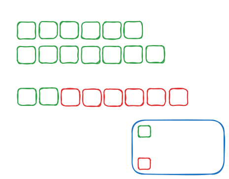

# Build your own coding agent

---

# Outline

- Introduction
- Large Language Models
- OpenAI Completions API
- Tool Calling
- Coding Agents

---

# Introduction

Goals:
- Form a technical _intuition_
- **Build your own agent**

<br>

Non-goals:
- Teaching you to use agents effectively
- Train/finetune your own LLM
- Discuss ethics/merits of LLMs
- Discuss company AI strategy

---

# Large Language Models (LLMs)

- _Stateless_ magic black box
  - `def LLM(input: str) -> str` <!-- ignoring multi-modal -->
- Internal representation: [tokens](https://tiktokenizer.vercel.app/) (demo)
  - [Andrey Karpathy: Deep Dive into LLMs like ChatGPT](https://www.youtube.com/watch?v=7xTGNNLPyMI)
- Context window: maximum `input` length

---

# LLM Providers

- 🇺🇸 OpenAI (ChatGPT/Codex)
- 🇺🇸 Anthropic (Claude)
- 🇺🇸 Google (Gemini)
- 🇪🇺 Mistral AI
- 🇨🇳 Z.ai/Moonshot/MiniMax

<br>

Reseller: [OpenRouter](https://openrouter.ai/)

---

# OpenAI API: Endpoints

Two endpoints:

1. **`/v1/chat/completions`**
   - Older, widely-supported (OpenRouter)
   - Stateless
2. `/v1/messages`
   - Newer, more features, worse support
   - Optional state: `previous_message_id`

<br>

Anthropic API: `/v1/messages` (Claude Code) <!-- Chinese providers compatibility -->

---

# OpenAI API: Messages Request

```http
POST http://127.0.0.1:1234/v1/chat/completions HTTP/1.1
Content-Type: application/json
Authorization: Bearer <YOUR_API_KEY>
```

```json
{
  "model": "openai/gpt-oss-20b",
  "messages": [
    { "role": "system", "content": "You answer in one word." },
    { "role": "user", "content": "Which country invented brie?" }
  ]
}
```

---

# OpenAI API: Messages message

```json
{
  "id": "chatcmpl-14g3zft88igr1q1vr3crc2q",
  "object": "chat.completion",
  "model": "openai/gpt-oss-20b",
  "choices": [
    {
      "message": {
        "role": "assistant",
        "content": "France",
        "reasoning": "Need one word answer. Brie invented in France. So answer: France.",
        "tool_calls": []
      },
      "finish_reason": "stop"
    }
  ]
}
```

---

# OpenAI API: Messages Demo

- `demos/chat-turn1.http`
- `demos/chat-turn2.http`

---

# Tool Calling: History

'Historically' (2023) tool calling worked using _few-shot prompting_: **demo!**

- Downsides?

---

# Tool Calling: OpenAI API

```json
{
  "messages": [ ... ],
  "tools": [
    {
      "type": "function",
      "function": {
        "name": "get_weather",
        "description": "Get the current weather for a location",
        "parameters": {
          "type": "object",
          "required": [
            "location"
          ],
          "properties": {
            "location": {
              "type": "string",
              "description": "The location to get the weather for"
            }
          }
        }
      }
    }
  ]
}
```

---

# Tool Calling: Demo

- `demos/tools-turn1.http`
- `demos/tools-turn2.http`

---

# Coding Agents: Definition

> An LLM agent runs tools in a loop to achieve a goal.
> \- Simon Willison ([September 2025](https://simonwillison.net/2025/Sep/18/agents/))

---

# Coding Agents: Pseudocode

```python
messages = [{ "role": "system", "content": SYSTEM_PROMPT }]
while True:
  user_input = input()
  messages.append({ "role": "user", "content": user_input })

  while True:
    message = llm_request({
      "model": "openai/gpt-oss-20b",
      "messages": messages,
      "tools": TOOL_DEFINITIONS,
    })["choices"][0]["message"]
    messages.append(message) # "role": "assistant"

    if not message.get("tool_calls"):
      print(message["content"])
      break
    
    for tool_call in message["tool_calls"]
      result: str = call_tool(tool_call) # TODO: implement
      messages.append({ "role": "tool", "content": result,
                        "tool_call_id": tool_call["id"] })
```

---

# Coding Agents: Caching

Possible to modify the `messages` between turns, but **more expensive**.

Model providers use caching to speed up requests with the same `messages` prefix, otherwise every token has to be re-processed.



---

# Templates

- Python/C++
- Functionality
  - JSON POST (with logging)
  - `bash_command`
  - [Pi's](https://pi.dev) `system-prompt.md`

---

# Coding Time!

```bash
# Clone repository
git clone https://github.com/mrexodia/agent

# Check the exercises
cat agent/EXERCISES.md
```